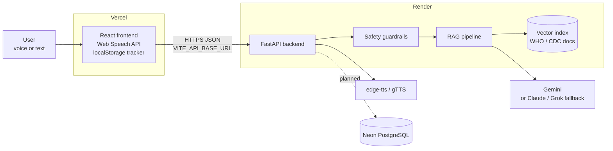
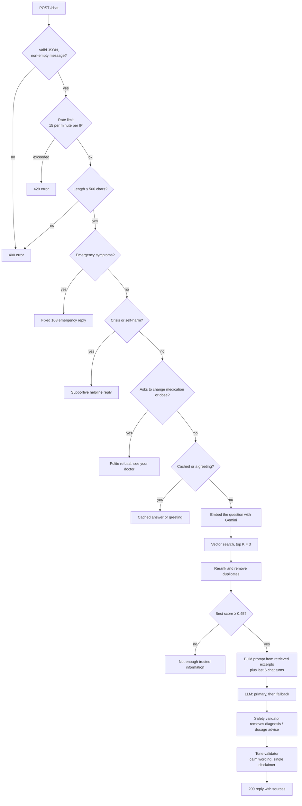
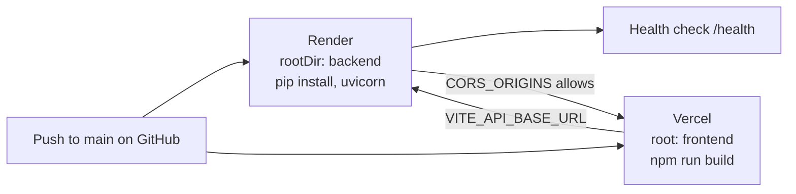

# Tamil Voice Diabetes Assistant — Project Overview

A bilingual (Tamil / English), voice-enabled web app for diabetes **education**. Users ask questions by voice or text and get answers grounded in WHO and CDC guidance, read aloud if they want. A built-in tracker logs blood glucose and daily wellness on the user's own device.

> The assistant is educational only. It never diagnoses, prescribes, or changes medication, and it routes emergencies to **108**.

---

## 1. Tech Stack

| Layer | Technology | Purpose |
|---|---|---|
| **Frontend** | React 19 + Vite | Single-page app: chat, voice, tracker |
| | Web Speech API (browser) | Speech-to-text input and native text-to-speech voices |
| | localStorage | Glucose and wellness records stay on the user's device |
| | Hand-built SVG | Glucose trend chart (no chart library) |
| | Vitest | Unit tests for tracker, chart, and question logic |
| **Backend** | Python 3.11 + FastAPI | REST API |
| | Uvicorn | ASGI server |
| | python-dotenv | Loads `backend/.env` |
| | pytest + FastAPI TestClient | API and service tests |
| **AI** | Google Gemini (`google-genai`) | Answer generation (default LLM) |
| | Gemini embeddings (`gemini-embedding-001`) | Vectors for semantic search |
| | Claude / Grok (optional) | Fallback LLM providers via `PRIMARY_LLM` / `SECONDARY_LLM` |
| **Knowledge (RAG)** | 15 WHO / CDC documents in Markdown | Trusted source material |
| | Local JSON vector index | `backend/data/index/knowledge_index.json`, prebuilt and committed |
| **Speech (server)** | edge-tts, with gTTS as fallback | MP3 voices `ta-IN-PallaviNeural` and `en-IN-NeerjaNeural` |
| **Database** | Neon PostgreSQL (planned) | `DATABASE_URL` is reserved and not used yet |
| **Hosting** | Vercel | Frontend |
| | Render (free tier) | Backend |

---

## 2. Architecture



The frontend and backend are deployed separately. The browser calls the API directly, and the backend accepts calls only from origins listed in `CORS_ORIGINS`.

---

## 3. Repository Structure

```
Tamil-Diabetes-Assistant/
├── backend/
│   ├── app/
│   │   ├── main.py          # App factory: CORS, security headers, error handlers, startup warm-up
│   │   ├── config.py        # Reads backend/.env
│   │   ├── routers/         # health, chat, tts, glucose, questions
│   │   └── services/        # rag_service, embedding_service, knowledge_base,
│   │                        # llm_provider, ai_service, guardrails,
│   │                        # safety_validator, glucose_service
│   ├── data/
│   │   ├── knowledge/       # WHO / CDC source documents (.md)
│   │   ├── index/           # Prebuilt vector index (JSON)
│   │   ├── glucose_reference.json
│   │   └── suggested_questions.json
│   ├── scripts/             # add_document, build_index, test_query
│   ├── tests/               # pytest suite
│   ├── requirements.txt / requirements-dev.txt
│   └── .env.example
├── frontend/
│   ├── src/
│   │   ├── components/      # layout/, chat/, tracker/
│   │   ├── hooks/           # useSpeechPlayback, useSpeechRecognition
│   │   ├── lib/             # api client, tracker storage, chart geometry, question picker (+ tests)
│   │   ├── data/            # fallback suggested questions
│   │   └── i18n.js          # Tamil and English UI text
│   ├── vercel.json
│   └── .env.example
├── docs/PROJECT_OVERVIEW.md # this file
├── render.yaml              # Render blueprint (rootDir: backend)
└── README.md
```

---

## 4. API Endpoints

| Method | Path | Purpose |
|---|---|---|
| GET | `/health` | Liveness check, used by Render |
| POST | `/chat` (aliases `/rag`, `/rag/ask`) | Ask a question. Body: `{ message, language, history }` |
| POST | `/tts` | Convert one sentence to MP3. Body: `{ text, language }` |
| POST | `/glucose/respond` | Educational feedback on a reading. Body: `{ value, measurement_type, language, symptoms }` |
| GET | `/questions/suggested` | Suggested-question pool. Optional `topic`, `exclude`, `limit` |
| GET | `/docs` | Interactive OpenAPI docs (generated by FastAPI) |

Every error response has the shape `{ "error": "..." }`.

---

## 5. How a Chat Question Is Answered



Key points:
- **Safety checks run first and need no AI.** Emergency, crisis, and medication questions get fixed, reviewed replies before any model is called.
- **Answers are grounded in sources.** The model only sees excerpts from the approved sources (`ALLOWED_KNOWLEDGE_SOURCES`: WHO, ICMR, MoHFW, CDC), and the reply lists them under "Trusted Sources".
- **Weak matches are declined.** If no excerpt scores at least `RAG_MIN_SCORE` (0.45), the assistant says it doesn't have enough trusted information instead of guessing.
- **Model output is checked again.** Replies pass through a safety validator and a tone validator before reaching the user.
- **Personal questions are never cached.** Questions containing personal readings or doses always go through the full pipeline.

---

## 6. Other Workflows

### Voice input and voice replies
1. The user taps the mic. The browser's Web Speech API transcribes in `ta-IN` or `en-IN` and shows a live preview.
2. When the user stops speaking, the transcript is sent to `/chat`.
3. A reply to a **voice** question is read aloud automatically:
   - If the device has a native voice for that language, the browser speaks the reply directly.
   - Otherwise the reply is split into sentences. Each sentence is requested from `POST /tts` in parallel and played in order, so audio starts after the first sentence instead of the whole reply. The server caches the last 250 sentences in memory.
4. Every reply also has **Listen** and **Copy** buttons.

> Browsers only allow the microphone on **HTTPS or localhost**.

### Glucose and wellness tracker
1. The user enters a reading (20–600 mg/dL), measurement type, date, time, and optional notes.
2. The reading is **saved to localStorage first**, and the chart, history, and insight update immediately.
3. The app then calls `POST /glucose/respond` for educational feedback. If that call fails, the reading stays saved and a fallback message is shown.
4. The trend chart shades the 70–180 mg/dL reference band. The insight box is rule-based: it looks at the average, recent trend, and variation.
5. Wellness logs (activity minutes, water glasses) are stored the same way and appear under the **Wellness** history filter.

> Tracker data never leaves the device today. Syncing it to Neon is the planned use of `DATABASE_URL`.

### Adding knowledge documents
Run these from `backend/`:
```bash
python -m scripts.add_document path/to/guideline.md --check-only   # validate metadata and source
python -m scripts.add_document path/to/guideline.md                # add to data/knowledge/
python -m scripts.build_index                                      # re-embed and rewrite the index (needs GEMINI_API_KEY)
python -m scripts.test_query                                       # try a sample search
```
Commit the updated `data/index/knowledge_index.json`, because Render serves this prebuilt index.

---

## 7. Configuration

All secrets live in `.env` files, which git ignores. Only the `.env.example` templates are committed.

**`backend/.env`**

| Variable | Default | Notes |
|---|---|---|
| `PORT` | `8000` | Render sets this automatically |
| `DEBUG` | `False` | |
| `CORS_ORIGINS` | `http://localhost:5173,…` | Comma-separated frontend URLs. Add the Vercel URL in production |
| `CORS_ORIGIN_REGEX` | empty | Pattern for changing URLs such as Vercel previews (preset in `render.yaml`) |
| `GEMINI_API_KEY` | — | **Required** for AI answers and embeddings |
| `GEMINI_MODEL` | `gemini-flash-lite-latest` | `.env.example` and `render.yaml` set `gemini-3.5-flash` |
| `PRIMARY_LLM` / `SECONDARY_LLM` | `gemini` / empty | Choose from `gemini`, `claude`, `grok` |
| `ANTHROPIC_API_KEY`, `XAI_API_KEY` | — | Only needed for the Claude / Grok fallbacks |
| `RAG_TOP_K` / `RAG_MIN_SCORE` | `3` / `0.45` | Retrieval tuning |
| `ALLOWED_KNOWLEDGE_SOURCES` | `WHO,ICMR,MoHFW,CDC` | Approved source authorities |
| `DATABASE_URL` | — | Neon connection string (reserved) |

**`frontend/.env.local`**

| Variable | Example | Notes |
|---|---|---|
| `VITE_API_BASE_URL` | `http://localhost:8000` | Backend URL. **This is bundled into public JavaScript, so never put secrets here.** |

---

## 8. Development Workflow

### Run locally
```bash
# Terminal 1: backend at http://localhost:8000
cd backend
python -m venv .venv && .venv\Scripts\activate      # macOS/Linux: source .venv/bin/activate
pip install -r requirements-dev.txt
copy .env.example .env                               # then add GEMINI_API_KEY
uvicorn app.main:app --reload --port 8000

# Terminal 2: frontend at http://localhost:5173
cd frontend
npm install
copy .env.example .env.local
npm run dev
```
If port 8000 is already taken, start Uvicorn with `--port 8001` and set `VITE_API_BASE_URL=http://localhost:8001` in `frontend/.env.local`.

### Test and build
```bash
cd backend  && pytest            # API, RAG, guardrails, safety, TTS, scripts
cd frontend && npm test          # tracker, chart, question picker, speech text
cd frontend && npm run build     # production bundle in dist/
```

### Git workflow
1. Branch from `main`, for example `feature/neon-sync` or `fix/tts-timeout`.
2. Commit with conventional prefixes: `feat:`, `fix:`, `refactor:`, `docs:`.
3. Run both test suites before pushing.
4. Push the branch, open a pull request into `main`, and merge after review.
5. Merging to `main` triggers deploys on Render and Vercel.

---

## 9. Deployment Workflow



**Backend on Render**
1. In Render, choose **New → Blueprint** and select the repository. `render.yaml` creates the service from `backend/`.
2. Set the secret variables: `GEMINI_API_KEY`, `CORS_ORIGINS` (the Vercel URL), and `DATABASE_URL` (optional for now).
3. Render runs `uvicorn app.main:app --host 0.0.0.0 --port $PORT` and checks `/health`. Only changes under `backend/` trigger a redeploy.
4. Delete the old Render service that served the whole app.

**Frontend on Vercel**
1. Import the repository and set **Root Directory** to `frontend`. `frontend/vercel.json` sets the build (`npm ci`, `npm run build`), long-term caching for `/assets`, and security headers.
2. Set `VITE_API_BASE_URL` to the Render URL.
3. After the first deploy, add the Vercel URL to the backend's `CORS_ORIGINS`.

> On Render's free tier, the service sleeps after a period with no traffic, so the first request after that can take 30–60 seconds.

---

## 10. Security and Safety Summary

| Concern | Control |
|---|---|
| Secrets | `.env` files are git-ignored; only empty `.env.example` templates are committed. A test fails if `.env` isn't ignored or the template contains a key. |
| Cross-origin access | Only origins in `CORS_ORIGINS` or matching `CORS_ORIGIN_REGEX` may call the API |
| Abuse | Per-IP rate limits (chat 15/min, TTS 25/min) and 500-character question limit; requests over 1 MB are rejected |
| HTTP headers | `X-Content-Type-Options`, `X-Frame-Options`, `Referrer-Policy` on every response |
| Medical safety | Deterministic emergency, crisis, and medication intercepts; source-grounded answers; safety and tone validators on every model reply |
| Health data privacy | Tracker data stays in the browser's localStorage and is not sent to the server, except a single reading for feedback, which isn't stored |

---

## 11. Roadmap

- [ ] **Neon PostgreSQL**: persist tracker data and conversation history using `DATABASE_URL`, with user accounts
- [ ] Store the vector index in Postgres (pgvector) instead of a JSON file
- [ ] Add Indian guidance (ICMR / MoHFW) to the knowledge base
- [ ] Continuous integration: run `pytest` and `npm test` on every pull request
